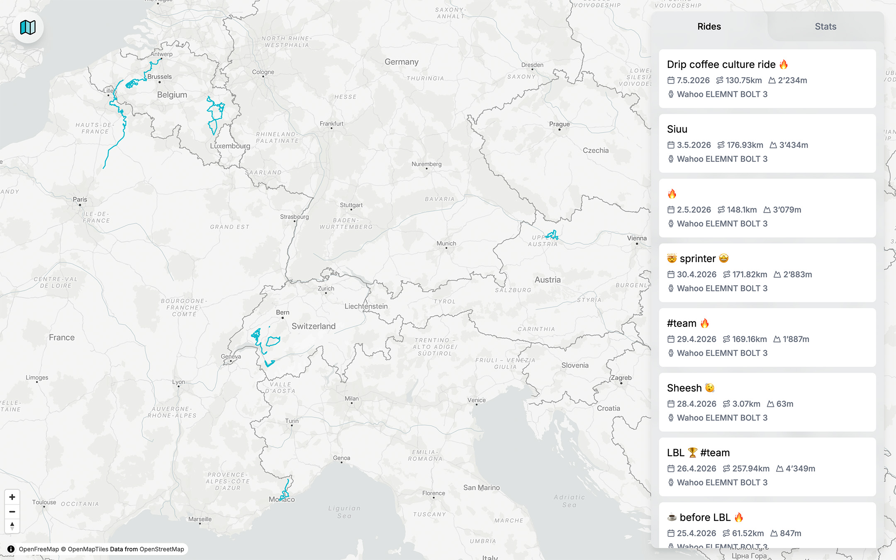
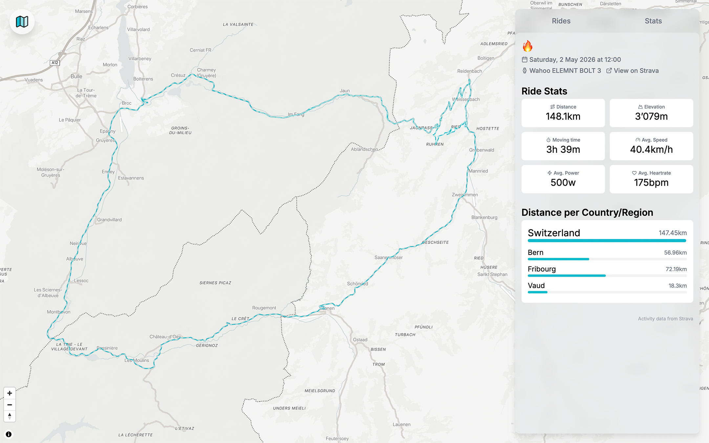
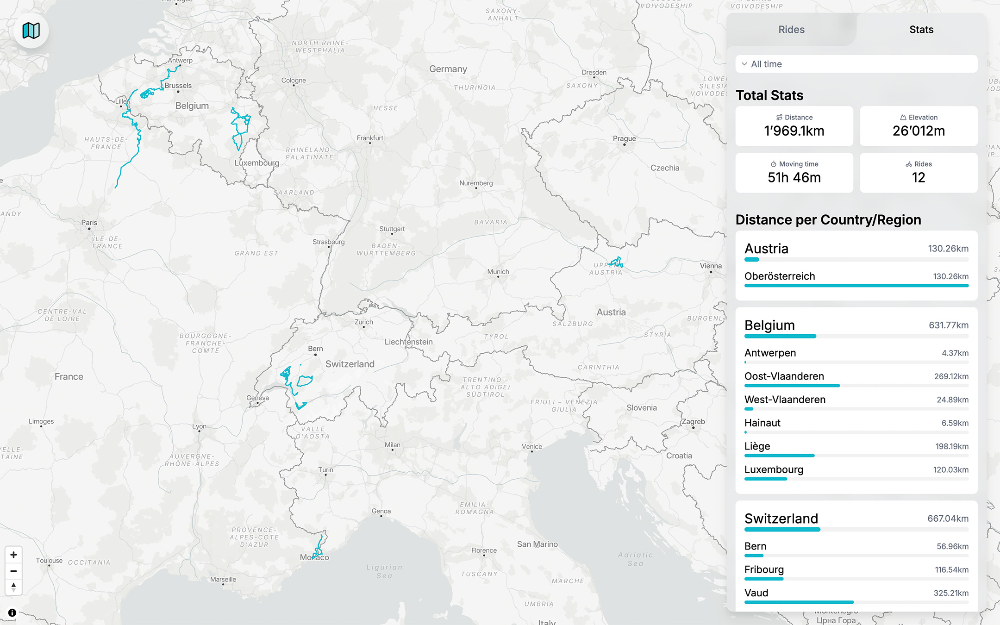

# CycleAtlas – A Cycling Route Visualizer

**As a passionate road cyclist and data junkie, I wanted to visualize all my cycling routes on a map and know exactly everywhere I've already been on a bike.**

That's how CycleAtlas was born, a small app for visualizing all your cycling routes. It shows the routes and places you've already explored on two wheels. It also tracks the distances covered in each country, and for Austria, Belgium, Switzerland, Germany, France, and Italy, even broken down by region or canton.

User routes are downloaded via the Strava API and processed to calculate distances by country, region, or canton. Through Strava webhooks, new activities are also automatically added the moment they are uploaded to Strava.

## Demo

Explore the demo here: [https://cycleatlas.cloud.guerraz.co](https://cycleatlas.cloud.guerraz.co/api/auth/demo). The sample data consists of cycling routes by Tadej Pogačar (UCI Road World Champion 2024 & 2025). Or sign in with your own Strava account to visualize your own rides.

## Screenshots

All cycling routes visible on a map

View details and statistics for a selected route

View details and statistics for all routes or filter by year

Live indicator that new activities are being processed in the background
